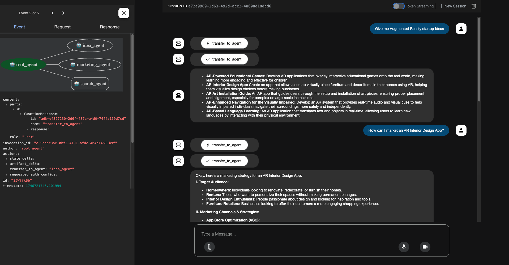

# 🚀 Google ADK Examples

A collection of simple, well-structured code snippets and real-world examples to help you get started with **Google ADK (Agent Development Kit)**.

> 📦 Build AI agents with tools, memory, and multi-agent orchestration – the Google way.

## This Repo is being constantly updated and maintained <3

## 📌 What is Google ADK?

The **Agent Development Kit** from Google is a Python SDK that simplifies building LLM-based agents.  
It supports everything from single-purpose agents to complex, multi-agent systems.

- 🧠 Memory & State Handling
- 🛠️ Tool Usage
- 🤝 Agent Collaboration
- 🧭 Planning, Routing & Orchestration
- 📦 Production-Ready Architecture

---

## 📋 Table of Contents

- [Project Overview](#project-overview)
- [Installation](#installation)
- [Examples](#examples)
  - [1. Basic Agent](#1-basic-agent)
  - [2. Tool Agent](#2-tool-agent)
  - [3. MCP Agent](#3-mcp-agent)
  - [4. Structured Output](#4-structured-output)
  - [5. Sessions](#5-sessions)
  - [6. Multi-Agents](#6-multi-agents)
- [Usage](#usage)
- [Dependencies](#dependencies)
- [Contributing](#contributing)

## 🔍 Project Overview

This project showcases different implementations of Google's ADK to create AI agents with varying capabilities:

- **Basic agents** that can have simple conversations
- **Tool-enabled agents** that leverage Google Search
- **MCP (Machine Comprehension Platform) agents** for specialized operations
- **Structured output agents** that return data in specific formats
- **Session-aware agents** that maintain state across conversations
- **Multi-agent systems** that coordinate between specialized sub-agents

## 🛠️ Installation

1. Clone the repository:

```bash
git clone https://github.com/yourusername/google-adk-examples.git
cd google-adk-examples
```

2. Create a virtual environment:

```bash
python -m venv venv
source venv/bin/activate  # On Windows, use: venv\Scripts\activate
```

3. Install dependencies:

```bash
pip install -r requirements.txt
```

4. Set up environment variables:

```bash
cp .env.example .env
```

5. Edit the `.env` file and add your Google API key:

```
GOOGLE_GENAI_USE_VERTEXAI=FALSE
GOOGLE_API_KEY=YOUR_API_KEY_HERE
```

6. Each example can be run individually. Here's how to run the basic session example:

```bash
cd 5-sessions.basic_session
```

Run the web agent using ADK Web UI

```bash
adk web
```



## 📦 Dependencies

- `google-adk`: Google's Agent Development Kit
- `google-generativeai`: Google's Generative AI library
- `yfinance`: Yahoo Finance data retrieval
- `psutil`: System and process utilities
- `litellm`: LLM management library
- `python-dotenv`: Environment variable management

## 🤝 Contributing

1. Fork the repository
2. Create a feature branch: `git checkout -b feature/your-feature`
3. Commit your changes: `git commit -m 'Add your feature'`
4. Push to the branch: `git push origin feature/your-feature`
5. Open a pull request
